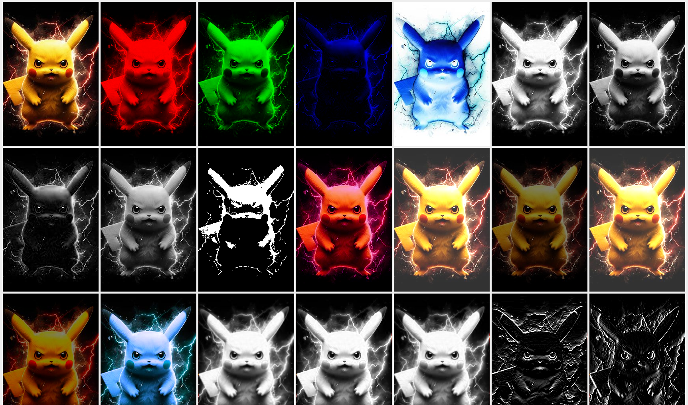

# Processamento de Imagens
Este repositório contém uma série de filtros de processamento de imagens implementados em Java, utilizando a biblioteca java.awt para manipulação de imagens.

A primeira imagem apresentada será a original, seguindo-se as imagens com os filtros selecionados.

### Como Utilizar
Cada filtro é um método que pode ser utilizado da seguinte forma:

1. Carregue uma imagem em um objeto BufferedImage.
2. Chame o método do filtro desejado, passando a imagem como parâmetro.
3. Receba a nova imagem como resultado do método.

## Exemplo visual dos filtros

## Operações Pontuais

### 1 - Sistemas de Cores RGB e YIQ

#### 1.1 - bandaRed
Este filtro mantém apenas a banda vermelha da imagem, zerando as informações das bandas verde e azul.

#### 1.2 - bandaGreen
Este filtro mantém apenas a banda verde da imagem, zerando as informações das bandas vermelha e azul.

#### 1.3 - bandaBlue
Este filtro mantém apenas a banda azul da imagem, zerando as informações das bandas vermelha e verde.

#### 1.4 - negativo
Este filtro gera o negativo da imagem, invertendo os valores de todas as bandas de cor (vermelha, verde e azul).

#### 1.5 - greyScaleRed
Este filtro converte a imagem para escala de cinza, considerando apenas a banda vermelha.

#### 1.6 - greyScaleGreen
Este filtro converte a imagem para escala de cinza, considerando apenas a banda verde.

#### 1.7 - greyScaleBlue
Este filtro converte a imagem para escala de cinza, considerando apenas a banda azul.

#### 1.8 - greyScaleMedia
Este filtro converte a imagem para escala de cinza, calculando a média das bandas vermelha, verde e azul.

#### 1.9 - binarizacao
Este filtro converte a imagem para uma imagem binária (preto e branco), utilizando um limiar especificado.

#### 1.10 - alteraTonalidade
Este filtro altera a tonalidade da imagem em uma determinada banda (vermelha, verde ou azul), adicionando um valor especificado.

#### 1.11 - brilhoAditivo
Este filtro aumenta o brilho da imagem adicionando um valor especificado em todas as bandas (vermelha, verde e azul).

#### 1.12 - brilhoMultiplicativo
Este filtro aumenta o brilho da imagem multiplicando os valores das bandas (vermelha, verde e azul) por um fator especificado.

#### 1.13 - brilhoAditivoY
Este filtro aumenta o brilho da imagem na escala YIQ adicionando um valor especificado na componente Y (luminância).

#### 1.14 - brilhoMultiplicativoY
Este filtro aumenta o brilho da imagem na escala YIQ multiplicando o valor da componente Y (luminância) por um fator especificado.

#### 1.15 - negativoY
Este filtro gera o negativo da imagem na escala YIQ, invertendo o valor da componente Y (luminância).

## Operações Locais

### 2 - Kernel ou máscara de convolução
O kernel é a matriz que define a transformação a ser aplicada, enquanto a convolução é o processo de aplicar esse kernel à imagem para realizar a transformação desejada.

#### 2.1 - Kernel Gaussiano
Este filtro é frequentemente usado para suavizar imagens, reduzindo o ruído e as transições bruscas de intensidade.

{ 0.0625, 0.125, 0.0625, 0.125, 0.25, 0.125, 0.0625, 0.125, 0.0625 }

#### 2.2 - Kernel de Sobel (Horizontal e Vertical)
Estes filtros são comumente usados para detecção de bordas em imagens.

horizontal → { -1, -2, -1, 0, 0, 0, 1, 2, 1 }
vertical → { -1, 0, 1, -2, 0, 2, -1, 0, 1 }

#### 2.3 - Kernel de Laplaciano
Este filtro é usado para detectar mudanças de intensidade em uma imagem, realçando áreas de alta frequência.

{ 0, -1, 0, -1, 4, -1, 0, -1, 0 }

### 3 - Média da Vizinhança
A média da vizinhança de um pixel é calculada como a média dos valores de intensidade dos pixels ao redor dele.

### 4 - Mediana da Vizinhança
A mediana da vizinhança de um pixel é calculada como o valor do pixel que está no meio da distribuição ordenada dos valores de intensidade dos pixels ao redor dele.